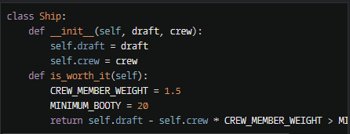
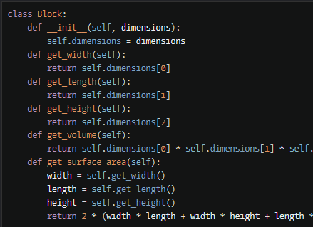
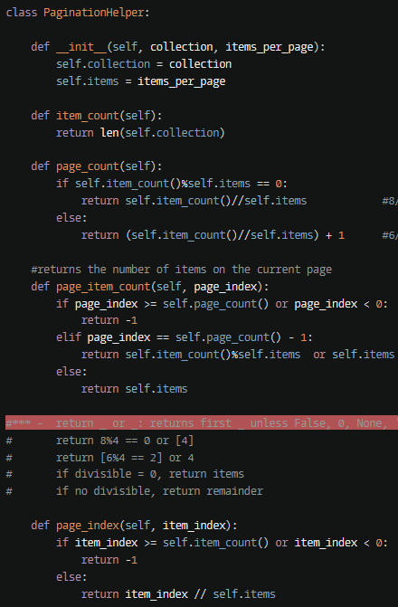
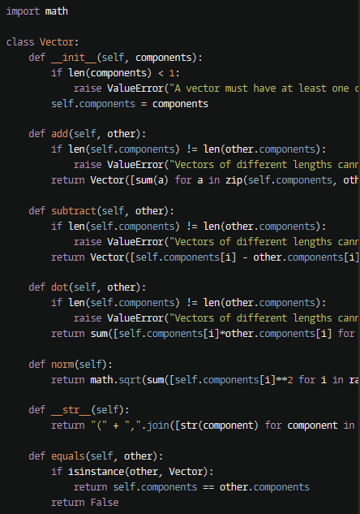
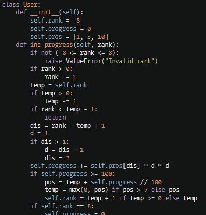
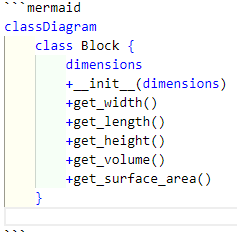
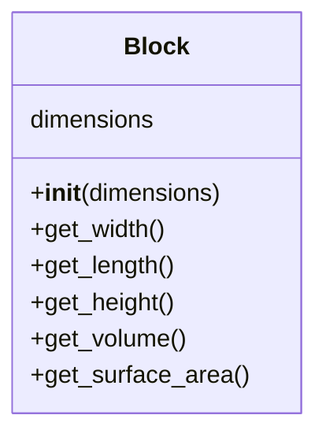

# 实验七 Python面向对象编程

班级： 21计科4

学号： B20210302427

姓名： 潘俊

Github地址：<https://github.com/panjun2003>

CodeWars地址：<https://www.codewars.com/users/pj030510>

---

## 实验目的

1. 学习Python类和继承的基础知识
2. 学习namedtuple和DataClass的使用

## 实验环境

1. Git
2. Python 3.10
3. VSCode
4. VSCode插件

## 实验内容和步骤

### 第一部分

Python面向对象编程

完成教材《Python编程从入门到实践》下列章节的练习：

- 第9章 类

---

### 第二部分

在[Codewars网站](https://www.codewars.com)注册账号，完成下列Kata挑战：

---

#### 第一题：面向对象的海盗

难度： 8kyu

啊哈，伙计!

你是一个小海盗团的首领。而且你有一个计划。在OOP的帮助下，你希望建立一个相当有效的系统来识别船上有大量战利品的船只。
对你来说，不幸的是，现在的人很重，那么你怎么知道一艘船上装的是黄金而不是人呢？

你首先要写一个通用的船舶类。

```python
class Ship:
    def __init__(self, draft, crew):
        self.draft = draft
        self.crew = crew
```

每当你的间谍看到一艘新船进入码头，他们将根据观察结果创建一个新的船舶对象。

- `draft`吃水 - 根据船在水中的高度来估计它的重量
- `crew`船员 - 船上船员的数量

`Titanic = Ship(15, 10)`

任务

你可以访问船舶的 "draft(吃水) "和 "crew(船员)"。"draft(吃水) "是船的总重量，"船员 "是船上的人数。
每个船员都会给船的吃水增加1.5个单位。如果除去船员的重量后，吃水仍然超过20，那么这艘船就值得掠夺。任何有这么重的船一定有很多战利品!
添加方法
`is_worth_it`
来决定这艘船是否值得掠夺。


```python
class Ship:
    def __init__(self, draft, crew):
        self.draft = draft
        self.crew = crew
    def is_worth_it(self):  
        CREW_MEMBER_WEIGHT = 1.5  
        MINIMUM_BOOTY = 20  
        return self.draft - self.crew * CREW_MEMBER_WEIGHT > MINIMUM_BOOTY

```



祝你好运，愿你能找到金子!

代码提交地址：
<https://www.codewars.com/kata/54fe05c4762e2e3047000add>

---

#### 第二题： 搭建积木

难度：7kyu

写一个创建Block的类（Duh.）
构造函数应该接受一个数组作为参数，这个数组将包含3个整数，其形式为`[width, length, height]`，Block应该由这些整数创建。

定义这些方法:

- `get_width()` return the width of the `Block`
- `get_length()` return the length of the `Block`
- `get_height()` return the height of the `Block`
- `get_volume()` return the volume of the `Block`
- `get_surface_area()` return the surface area of the `Block`

例子：

```python
b = Block([2,4,6]) # create a `Block` object with a width of `2` a length of `4` and a height of `6`
b.get_width() # return 2    
b.get_length() # return 4
b.get_height() # return 6
b.get_volume() # return 48
b.get_surface_area() # return 88
```


```python
class Block:  
    def __init__(self, dimensions):  
        self.dimensions = dimensions  
    def get_width(self):  
        return self.dimensions[0]  
    def get_length(self):  
        return self.dimensions[1]  
    def get_height(self):  
        return self.dimensions[2]  
    def get_volume(self):  
        return self.dimensions[0] * self.dimensions[1] * self.dimensions[2]  
    def get_surface_area(self):  
        width = self.get_width()  
        length = self.get_length()  
        height = self.get_height()  
        return 2 * (width * length + width * height + length * height)
```




注意： 不需要检查错误的参数。

代码提交地址：
<https://www.codewars.com/kata/55b75fcf67e558d3750000a3>

---

#### 第三题： 分页助手

难度：5kyu

在这个练习中，你将加强对分页的掌握。你将完成PaginationHelper类，这是一个实用类，有助于查询与数组有关的分页信息。
该类被设计成接收一个值的数组和一个整数，表示每页允许多少个项目。集合/数组中包含的值的类型并不相关。

下面是一些关于如何使用这个类的例子：

```python
helper = PaginationHelper(['a','b','c','d','e','f'], 4)
helper.page_count() # should == 2
helper.item_count() # should == 6
helper.page_item_count(0)  # should == 4
helper.page_item_count(1) # last page - should == 2
helper.page_item_count(2) # should == -1 since the page is invalid

# page_index takes an item index and returns the page that it belongs on
helper.page_index(5) # should == 1 (zero based index)
helper.page_index(2) # should == 0
helper.page_index(20) # should == -1
helper.page_index(-10) # should == -1 because negative indexes are invalid
```

```python
class PaginationHelper:
    
    def __init__(self, collection, items_per_page):
        self.collection = collection                  
        self.items = items_per_page                 
      
    def item_count(self):                            
        return len(self.collection)

    def page_count(self):
        if self.item_count()%self.items == 0:       
            return self.item_count()//self.items            #8//4 = 2      
        else:
            return (self.item_count()//self.items) + 1      #6//4 = 1+1 = 2

    #returns the number of items on the current page
    def page_item_count(self, page_index):
        if page_index >= self.page_count() or page_index < 0:   #4 or page5 > 2 pages or page -7
            return -1
        elif page_index == self.page_count() - 1:               #last page[3 or 4th page == 4-1 pages](page index starting from 0 == total pages - 1)  
            return self.item_count()%self.items  or self.items  # ***
        else:                                                   #every other page
            return self.items
 
#*** -  return _ or _: returns first _ unless False, 0, None, ''
#       return 8%4 == 0 or [4]
#       return [6%4 == 2] or 4
#       if divisible = 0, return items
#       if no divisible, return remainder

    def page_index(self, item_index):
        if item_index >= self.item_count() or item_index < 0:   #lower or higher than number of items
            return -1
        else:                                                   #in range
            return item_index // self.items                     #2//4 = 0 - item 3 is on page 1
                                                                #5//4 = 1 - item 6 is on page 2 
```




代码提交地址：
<https://www.codewars.com/kata/515bb423de843ea99400000a>

---

#### 第四题： 向量（Vector）类

难度： 5kyu

创建一个支持加法、减法、点积和向量长度的向量（Vector）类。

举例来说：

```python
a = Vector([1, 2, 3])
b = Vector([3, 4, 5])
c = Vector([5, 6, 7, 8])

a.add(b)      # should return a new Vector([4, 6, 8])
a.subtract(b) # should return a new Vector([-2, -2, -2])
a.dot(b)      # should return 1*3 + 2*4 + 3*5 = 26
a.norm()      # should return sqrt(1^2 + 2^2 + 3^2) = sqrt(14)
a.add(c)      # raises an exception
```

如果你试图对两个不同长度的向量进行加减或点缀，你必须抛出一个错误。
向量类还应该提供：

- 一个 `__str__` 方法，这样 `str(a) === '(1,2,3)'`
- 一个equals方法，用来检查两个具有相同成分的向量是否相等。

注意：测试案例将利用用户提供的equals方法。

代码提交地址：
<https://www.codewars.com/kata/526dad7f8c0eb5c4640000a4>

```python
import math  
  
class Vector:  
    def __init__(self, components):  
        if len(components) < 1:  
            raise ValueError("A vector must have at least one component.")  
        self.components = components  
  
    def add(self, other):  
        if len(self.components) != len(other.components):  
            raise ValueError("Vectors of different lengths cannot be added.")  
        return Vector([sum(a) for a in zip(self.components, other.components)])  
  
    def subtract(self, other):  
        if len(self.components) != len(other.components):  
            raise ValueError("Vectors of different lengths cannot be subtracted.")  
        return Vector([self.components[i] - other.components[i] for i in range(len(self.components))])  
  
    def dot(self, other):  
        if len(self.components) != len(other.components):  
            raise ValueError("Vectors of different lengths cannot be dotted.")  
        return sum([self.components[i]*other.components[i] for i in range(len(self.components))])  
  
    def norm(self):  
        return math.sqrt(sum([self.components[i]**2 for i in range(len(self.components))]))  
  
    def __str__(self):  
        return "(" + ",".join([str(component) for component in self.components]) + ")"  
  
    def equals(self, other):  
        if isinstance(other, Vector):  
            return self.components == other.components  
        return False
```



---

#### 第五题： Codewars风格的等级系统

难度： 4kyu

编写一个名为User的类，用于计算用户在类似于Codewars使用的排名系统中的进步量。

业务规则：

- 一个用户从等级-8开始，可以一直进步到8。
- 没有0（零）等级。在-1之后的下一个等级是1。
- 用户将完成活动。这些活动也有等级。
- 每当用户完成一个有等级的活动，用户的等级进度就会根据活动的等级进行更新。
- 完成活动获得的进度是相对于用户当前的等级与活动的等级而言的。
- 用户的等级进度从零开始，每当进度达到100时，用户的等级就会升级到下一个等级。
- 在上一等级时获得的任何剩余进度都将被应用于下一等级的进度（我们不会丢弃任何进度）。例外的情况是，如果没有其他等级的进展（一旦你达到8级，就没有更多的进展了）。
- 一个用户不能超过8级。
- 唯一可接受的等级值范围是-8,-7,-6,-5,-4,-3,-2,-1,1,2,3,4,5,6,7,8。任何其他的值都应该引起错误。

逻辑案例：

- 如果一个排名为-8的用户完成了一个排名为-7的活动，他们将获得10的进度。
- 如果一个排名为-8的用户完成了排名为-6的活动，他们将获得40的进展。
- 如果一个排名为-8的用户完成了排名为-5的活动，他们将获得90的进展。
- 如果一个排名-8的用户完成了排名-4的活动，他们将获得160个进度，从而使该用户升级到排名-7，并获得60个进度以获得下一个排名。
- 如果一个等级为-1的用户完成了一个等级为1的活动，他们将获得10个进度（记住，零等级会被忽略）。

代码案例：

```python
class User:  
    def __init__(self):  
        self.rank = -8  
        self.progress = 0  
        self.pros = [1, 3, 10]  
    def inc_progress(self, rank):  
        if not (-8 <= rank <= 8):  
            raise ValueError("Invalid rank")  
        if rank > 0:  
            rank -= 1  
        temp = self.rank  
        if temp > 0:  
            temp -= 1  
        if rank < temp - 1:  
            return  
        dis = rank - temp + 1  
        d = 1  
        if dis > 1:  
            d = dis - 1  
            dis = 2  
        self.progress += self.pros[dis] * d * d  
        if self.progress >= 100:  
            pos = temp + self.progress // 100  
            temp = max(0, pos) if pos > 7 else pos  
            self.rank = temp + 1 if temp >= 0 else temp  
        if self.rank == 8:  
            self.progress = 0  
        else:  
            self.progress %= 100
```

代码提交地址：
<https://www.codewars.com/kata/51fda2d95d6efda45e00004e>




## 实验过程与结果

请将实验过程与结果放在这里，包括：

- [第一部分 Python面向对象编程](#第一部分)
- [第二部分 Codewars Kata挑战](#第二部分)
- [第三部分 使用Mermaid绘制程序流程图](#第三部分)

注意代码需要使用markdown的代码块格式化，例如Git命令行语句应该使用下面的格式：


显示效果如下：

```bash
git init
git add .
git status
git commit -m "first commit"
```

---

### 第三部分

使用Mermaid绘制程序的**类图**

安装VSCode插件：

- Markdown Preview Mermaid Support
- Mermaid Markdown Syntax Highlighting

使用Markdown语法绘制你的程序绘制程序类图（至少一个），Markdown代码如下：

---


显示效果如下：




**注意：不要使用截图，Markdown文档转换为Pdf格式后，截图可能会无法显示。**

## 实验考查

请使用自己的语言并使用尽量简短代码示例回答下面的问题，这些问题将在实验检查时用于提问和答辩以及实际的操作。

1. Python的类中__init__方法起什么作用？
2. Python语言中如何继承父类和改写（override）父类的方法。
3. Python类有那些特殊的方法？它们的作用是什么？请举三个例子并编写简单的代码说明。


1. Python的类中__init__方法起什么作用？

__init__方法是Python中的一个特殊方法，用于初始化类的实例。当创建一个类的实例时，__init__方法会被自动调用，用于对实例的属性进行初始化。在__init__方法中，可以对实例的属性进行赋值，也可以执行一些初始化操作。这样可以确保在创建实例时，实例的属性已经被正确初始化，从而使实例能够正常地工作。


2. Python语言中如何继承父类和改写（override）父类的方法。

在Python中，要继承父类并改写（override）父类的方法，可以通过创建子类并在子类中重新定义相同名称的方法来实现。当子类重新定义了父类中已经存在的方法时，子类的方法会覆盖（override）父类的方法。

例如：


```python
class ParentClass:
    def some_method(self):
        print("This is the method from the parent class")

class ChildClass(ParentClass):
    def some_method(self):
        print("This is the method from the child class")

# 创建子类的实例
child = ChildClass()

# 调用子类的方法
child.some_method()

```
3. Python类有那些特殊的方法？它们的作用是什么？请举三个例子并编写简单的代码说明。
   
 Python中的类有很多特殊的方法，也被称为魔术方法或双下划线方法。这些方法以双下划线开头和结尾，用于实现类的特定行为。以下是三个常用的特殊方法及其作用：

 ```python
1.__init__方法：用于初始化类的实例，在创建实例时自动调用。可以在这个方法中对实例的属性进行初始化。
class MyClass:
    def __init__(self, name):
        self.name = name

# 创建实例并初始化
obj = MyClass("Alice")
print(obj.name)  # 输出: Alice
 ```

 ```python
 2.__str__方法：用于返回对象的字符串表示。当使用print()函数或str()函数打印对象时，会自动调用__str__方法。
class Point:
    def __init__(self, x, y):
        self.x = x
        self.y = y

    def __str__(self):
        return f"Point({self.x}, {self.y})"

# 打印对象
p = Point(3, 4)
print(p)  # 输出: Point(3, 4)
 ```

 ```python
 3.__len__方法：用于返回对象的长度。当使用len()函数获取对象的长度时，会自动调用__len__方法。
class MyList:
    def __init__(self, items):
        self.items = items

    def __len__(self):
        return len(self.items)

# 获取对象的长度
lst = MyList([1, 2, 3, 4, 5])
print(len(lst))  # 输出: 5

 ```


## 实验总结

总的来说，学习Python类和继承的基础知识以及namedtuple和dataclass的使用，让我更好地理解面向对象编程的概念，并且能够更高效地创建和操作数据类。在本次实验中收获良多。